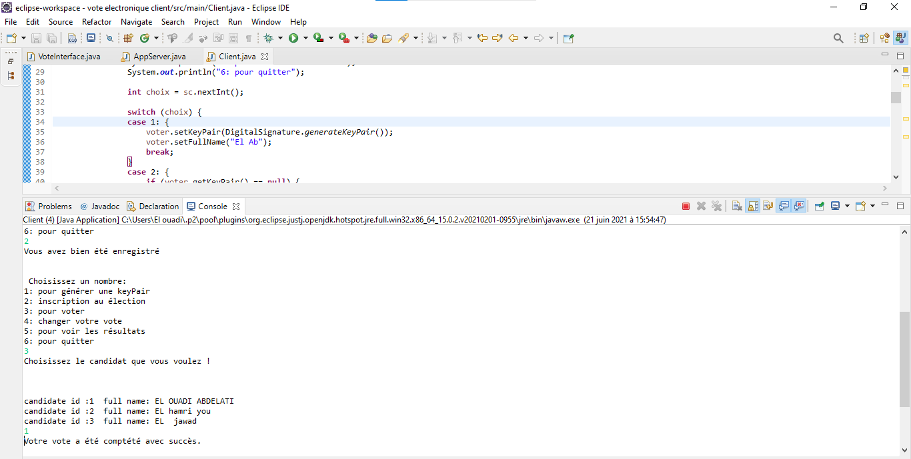
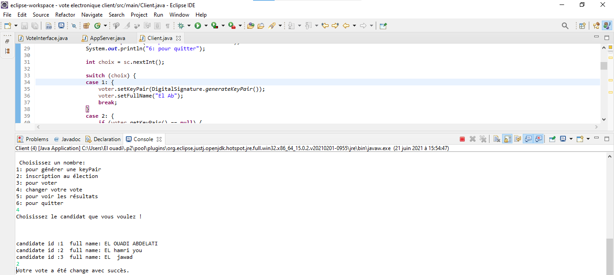
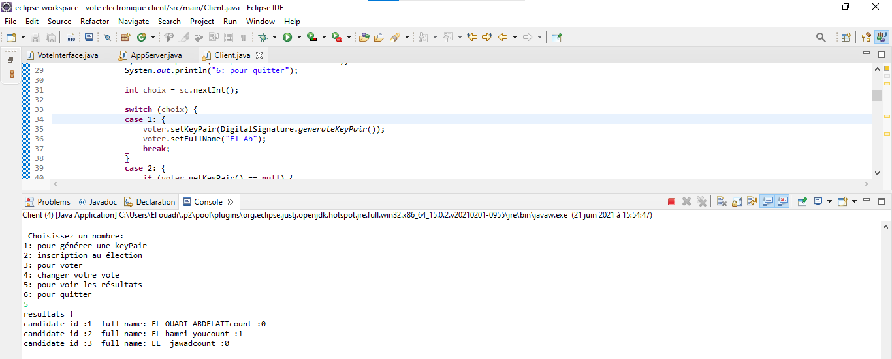

# vote-electronique-rmi 

# L'objectif 
   L'objectif est de créer un système de vote électronique, nous mettons également en œuvre le concept de signature électronique 
    afin de vérifier l'identité de l'électeur, ce système sera basé sur RMI (Remote method invocation). 
    
# Les fonctionnalités
 Tout d'abord lorsque nous démarrons le serveur, vous devez spécifier le [nom de l'élection avec la date de début et de fin du vote](#initserver), Ce serveur utilise la méthode "init" pour saisir les candidats et aussi il  proposera plusieurs méthodes :  
      1 :[ register](#register), pour qu'un  électeur s'inscrit dans l'élection avant le début du vote   
      2:  [vote](#vote)   , pour voter  
      3: [changeVote](#changeVote) ,pour changé le vote 4: getCandidats  
      5: [getResults](#getResults) 
  Concernant le client, tout d'abord, il faut créer une [keyPair](#keyPair) pour qu'il puisse utiliser les méthodes du serveur. 

# Test

  
  
  
  
  
  
 
  
  
  
  
  
  
  
  
  
  
  
  
